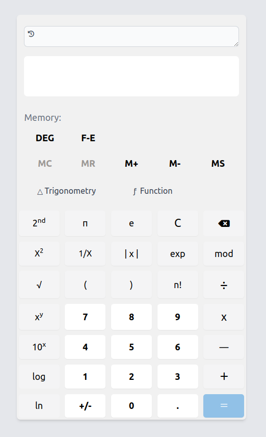

# [Scientific calculator](https://neha-devtime.github.io/scientific-calculator/)
This is an online javascript scientific calculator, designed and coded by [Neha dobariya](https://github.com/neha-devtime).\
**https://neha-devtime.github.io/scientific-calculator/**

<!--  --> 

### Features

- **Basic Arithmetic Operations**: Addition, subtraction, multiplication, division
- **Scientific Functions**: Sine, cosine, tangent, square root, logarithms (base 10 and natural)
- **Trigonometric Functions**: Supports inverse trigonometric operations (asin, acos, atan)
- **Exponential and Factorial Calculations**: Includes `exp()`, `pow()`, and `factorial()`
- **Mode Switching**: Switch between degree and radian mode for trigonometric functions
- **Memory**: Save and recall values in memory

### Technologies Used

- **HTML**: Structure of the web page
- **CSS & TAILWIND**: Styling and layout
- **JavaScript**: Main logic for performing calculations

### How to Use

1. **Click on buttons**: Use the calculator buttons for numbers, operations, and functions.
2. **Enter Expression**: Input mathematical expressions directly using the provided buttons.
3. **Calculate**: Click on the "equals" button (`=`) to evaluate the expression.
4. **Clear Expression**: Click on the "Clear" button (`C`) to clear the current expression.

### Contribution

If you want to contribute to this project, feel free to fork the repository and submit a pull request. Bug fixes and feature suggestions are always welcome.

### License

This project is licensed under the MIT License - see the [LICENSE](./LICENSE.txt) file for details.

---
